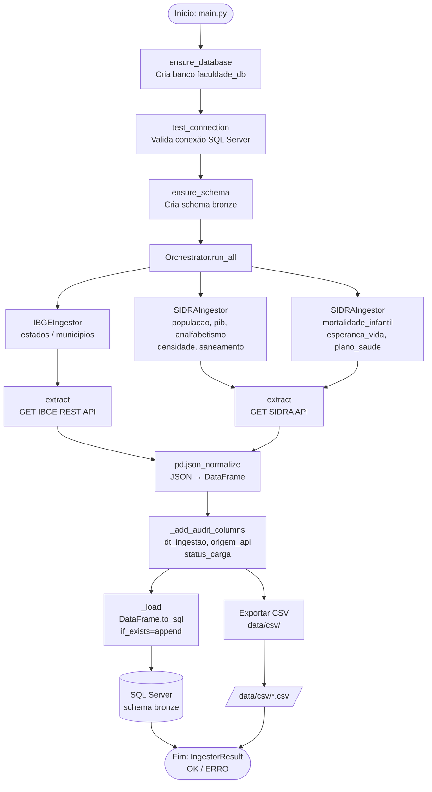

# 3. Metodologia

Esta seção detalha os procedimentos técnicos e metodológicos adotados para a construção da camada de ingestão do SocioEpiBR. O fluxo de trabalho foi estruturado sob os princípios da arquitetura Medallion [Armbrust et al. 2021], com foco na Zona Bronze — etapa responsável pela extração, transformação estrutural e carga dos dados brutos provenientes de fontes governamentais abertas. Nas subseções a seguir, são descritas as fontes selecionadas e a infraestrutura do pipeline ETL implementado.

## 3.1 Fontes de Dados

Os dados utilizados neste trabalho são provenientes de duas interfaces de programação de aplicações (APIs) públicas mantidas pelo Instituto Brasileiro de Geografia e Estatística (IBGE): a API REST de Localidades e a API do Sistema IBGE de Recuperação Automática (SIDRA).

A **API REST de Localidades** disponibiliza informações estruturadas sobre a divisão político-administrativa do Brasil. Por meio dos *endpoints* `/estados` e `/municipios`, é possível recuperar metadados das 27 unidades federativas e dos 5.571 municípios brasileiros, incluindo código identificador, sigla, nome oficial e região geográfica. Os dados são retornados no formato JSON (*JavaScript Object Notation*) e não requerem autenticação.

O **SIDRA** constitui o repositório central de tabelas estatísticas do IBGE, consolidando resultados de pesquisas como o Censo Demográfico, a Pesquisa Nacional por Amostra de Domicílios Contínua (PNAD Contínua) e o Cadastro Central de Empresas (CEMPRE). O acesso programático é realizado por meio da URL parametrizada no formato:

```
https://apisidra.ibge.gov.br/values/t/{tabela}/n{nivel}/{localidade}/v/{variavel}/p/{periodo}
```

onde `tabela` corresponde ao código numérico da pesquisa, `nivel` define a granularidade territorial (sendo `n3` referente às unidades da federação), `variavel` identifica o indicador desejado e `periodo` especifica o recorte temporal. A Tabela 1 apresenta as fontes utilizadas neste trabalho.

**Tabela 1 — Fontes de dados consumidas pelo pipeline**

| Tabela de destino | API | Código SIDRA | Descrição |
|---|---|---|---|
| `bronze.estados` | IBGE Localidades | — | Unidades federativas |
| `bronze.municipios` | IBGE Localidades | — | Municípios brasileiros |
| `bronze.populacao_por_estado` | SIDRA | 1612 | População residente por sexo e cor |
| `bronze.bronze_pib` | SIDRA | 5938 | PIB a preços correntes por UF |
| `bronze.bronze_analfabetismo` | SIDRA | 1378 | Taxa de analfabetismo — Censo 2010 |
| `bronze.bronze_densidade` | SIDRA | 1301 | Área territorial e densidade demográfica |
| `bronze.bronze_saneamento` | SIDRA | 1393 | Domicílios por tipo de esgotamento sanitário |
| `bronze.saude_mortalidade_infantil` | SIDRA | 2612 | Taxa de mortalidade infantil por UF |
| `bronze.saude_esperanca_vida` | SIDRA | 3175 | Esperança de vida ao nascer |
| `bronze.saude_plano_saude` | SIDRA | 3543 | Cobertura de serviços de saúde |

Todas as APIs são de acesso público, sem necessidade de autenticação, e retornam dados no formato JSON. A ausência de custos de licenciamento e a estabilidade dos *endpoints* tornam essas fontes adequadas para o contexto de um projeto acadêmico reproduzível.

---

## 3.2 Pipeline ETL

O pipeline de ingestão foi desenvolvido em Python 3.11 seguindo o padrão arquitetural ETL (*Extract, Transform, Load*), organizado em três fases bem delimitadas. A implementação adota o conceito de *Bronze Zone*, camada de armazenamento que preserva os dados brutos sem transformações semânticas, mantendo rastreabilidade e auditabilidade conforme preconizado por arquiteturas *Lakehouse* [Armbrust et al. 2021].

### Fase de Extração

A extração é realizada pela biblioteca `requests` [Reitz 2011], que executa requisições HTTP GET aos *endpoints* das APIs descritas na Seção 3.1. Para garantir resiliência a falhas transitórias de rede, o cliente HTTP é configurado com uma política de retentativa automática (*retry*) por meio do objeto `urllib3.util.retry.Retry`, com três tentativas máximas, *backoff* exponencial de fator 0,5 e reativação automática para os códigos de status HTTP 429, 500, 502, 503 e 504. O trecho abaixo ilustra a configuração adotada:

```python
from urllib3.util.retry import Retry
from requests.adapters import HTTPAdapter

retry = Retry(total=3, backoff_factor=0.5, status_forcelist=[429, 500, 502, 503, 504])
adapter = HTTPAdapter(max_retries=retry)
session.mount("https://", adapter)
```

A resposta JSON é desserializada em memória e encaminhada à fase de transformação.

### Fase de Transformação

A transformação é conduzida pela biblioteca `pandas` [McKinney 2010], amplamente utilizada em tarefas de manipulação de dados tabulares em Python. A função `pd.json_normalize()` é aplicada para achatar estruturas JSON aninhadas em um `DataFrame` bidimensional. Em seguida, são acrescentadas três colunas de auditoria a cada registro:

- `dt_ingestao`: *timestamp* UTC do momento da carga, armazenado sem informação de fuso horário para compatibilidade com o tipo `DATETIME2` do SQL Server;
- `origem_api`: URL completa consultada, permitindo rastreabilidade da origem do dado;
- `status_carga`: indicador de sucesso ou falha da ingestão (`SUCESSO` / `ERRO`).

Não são aplicadas transformações semânticas sobre os dados brutos, preservando a integridade da camada Bronze.

### Fase de Carga

A carga é realizada por meio da biblioteca `SQLAlchemy` [Bayer 2012] em conjunto com o driver `pyodbc`, que estabelece a conexão com uma instância do Microsoft SQL Server. O motor de banco de dados é instanciado como *singleton* via `functools.lru_cache`, evitando a criação redundante de conexões ao longo da execução. O método `DataFrame.to_sql()` é utilizado com a estratégia `if_exists="append"`, permitindo que o esquema da tabela seja inferido dinamicamente a partir do `DataFrame` e que execuções subsequentes acumulem registros sem sobrescrever os dados existentes. O parâmetro `fast_executemany=True` é habilitado para otimizar a inserção em lote.

Antes da carga, o pipeline verifica a existência do banco de dados `faculdade_db` e do esquema `bronze`, criando-os automaticamente caso não existam. Adicionalmente, cada execução exporta uma cópia dos dados em formato CSV no diretório `data/csv/`, fornecendo uma camada de *backup* local independente do banco de dados.

### Diagrama do Pipeline

O diagrama a seguir representa o fluxo de execução completo do pipeline, desde a consulta às APIs até a persistência no SQL Server.



### Considerações de Projeto

A arquitetura adotada favorece a extensibilidade: a adição de um novo ingestor requer apenas o registro de uma instância de `SIDRAIngestor` ou `IBGEIngestor` na função `build_ingestors()` do módulo `main.py`, sem a necessidade de criar novos arquivos ou modificar a lógica central do *Orchestrator*. Essa decisão de projeto reduz o acoplamento entre os ingestores e promove o princípio *Open/Closed* [Martin 2003], pelo qual o sistema está aberto para extensão, mas fechado para modificação.

---

### Referências desta seção

> ARMBRUST, M. et al. Lakehouse: A new generation of open platforms that unify data warehousing and advanced analytics. In: *CIDR*, 2021.
>
> BAYER, M. SQLAlchemy. In: BROWN, A.; WILSON, G. (eds.). *The Architecture of Open Source Applications*, vol. 2. 2012.
>
> IBGE. **API de localidades**. Disponível em: https://servicodados.ibge.gov.br/api/docs/localidades. Acesso em: jul. 2026.
>
> IBGE. **SIDRA — Sistema IBGE de Recuperação Automática**. Disponível em: https://sidra.ibge.gov.br. Acesso em: jul. 2026.
>
> McKINNEY, W. Data structures for statistical computing in Python. In: *Proceedings of the 9th Python in Science Conference*, 2010.
>
> MARTIN, R. C. *Agile Software Development: Principles, Patterns, and Practices*. Prentice Hall, 2003.
>
> REITZ, K. **Requests: HTTP for Humans**. Disponível em: https://requests.readthedocs.io. Acesso em: jul. 2026.
